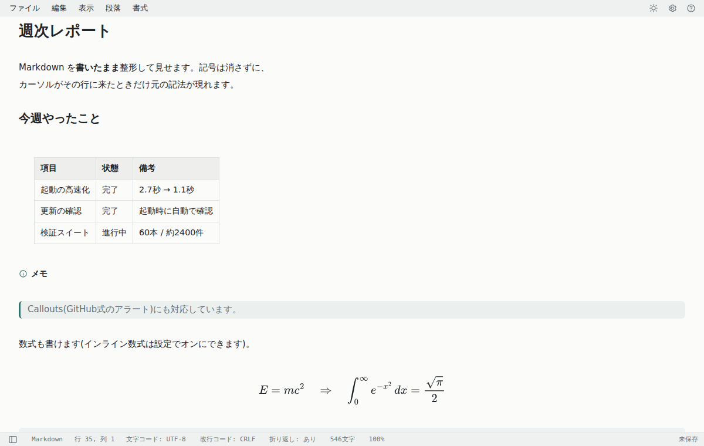
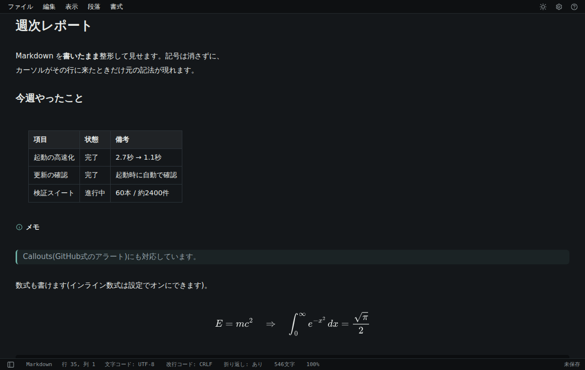
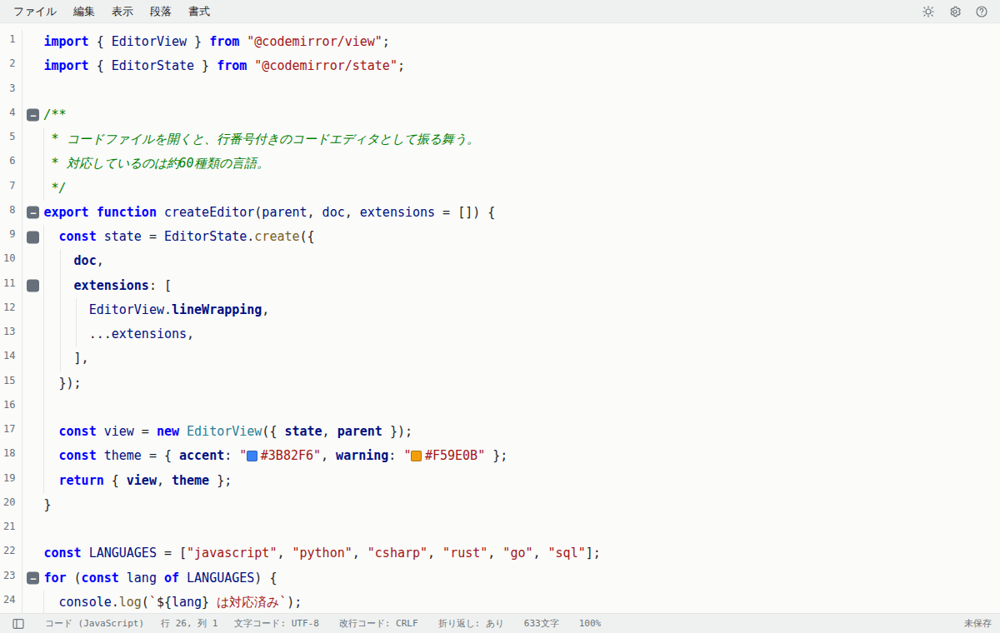

# Pane

Windows 向けの Markdown エディタです。インストール不要の単一実行ファイルで動きます。

Markdown をそのまま書きながら整形結果が見える（ライブプレビュー）エディタでありながら、
`.js` `.py` `.cs` `.json` などのコードファイルを開くと、**行番号付き・シンタックスハイライト付きの
コードエディタとしても使えます**。日々のメモ帳としても、ソースやログを覗く道具としても、
この1本で済ませられます。



見出し・表・Callouts・数式が、書いたそばから整形されて見えます。記号は消えず、
カーソルがその行に来たときだけ元の記法が現れます。

| 暗いテーマ | コードファイルを開いたところ |
| --- | --- |
|  |  |

## 主な特徴

- **インストール不要** — `Pane.exe` を好きな場所に置くだけ。レジストリを勝手に書き換えません
- **自分から外部へ問い合わせに行くのは更新の確認だけ** — 使用状況の送信も、テーマのダウンロードも、画像アップロード連携もありません。書いた内容が外部へ送信されることはありません（ただし文書中に`https://`の画像や埋め込みがあると、表示のためにその参照先への通信が発生します。詳細は取扱説明書「外部通信について」）
- **Markdown を書いたまま整形して見せる** — 見出し・表・数式・Mermaid 図・脚注・Callouts に対応
- **約60種類の言語のシンタックスハイライト** — 折りたたみ、インデントガイド、カラープレビュー付き
- **文字コードと改行コードを保って開き直す** — Shift_JIS の古いテキストもそのまま扱えます
- **9種類のテーマ** — カスタム CSS も読み込めます
- **PDF / HTML / Word / EPUB などへのエクスポート**（一部は Pandoc が必要）

## 動作環境

- Windows 10 / 11（64ビット）
- WebView2 ランタイム（Windows 11 には標準で入っています）

## インストール

[Releases](../../releases) から Zip をダウンロードして展開し、`Pane.exe` を実行してください。

`Pane.exe` と `dist` フォルダは同じ場所に置いたままにしてください。

設定と自動保存のデータは `%LOCALAPPDATA%\Pane\` に作られます。アンインストールは、
このフォルダと展開したフォルダを削除するだけです。

## 使い方

起動後に **F1キー** を押すと取扱説明書が開きます。

## 更新

設定 → バージョン情報 → 「更新を確認」を押すと、[Releases](../../releases) に新しい版があるかを調べます。
新しい版があれば、そのままダウンロードして入れ替えられます（ダウンロードしたZipはSHA256で照合します）。

同じ画面の「起動時に新しい版があるか確認する」がオンのときは、起動するたびに同じ確認を行い、
新しい版があれば画面上部でお知らせします。**お知らせするだけで、断りなく更新することはありません。**
この確認はオフにできます。

Paneが外部へ送るのは「新しい版はありますか」という問い合わせだけで、文書や使用状況は含みません。
問い合わせ先（`updateCheckUrl`）は設定画面に表示されます。

## ビルド

```bash
npm install
npm run build                      # dist/ を生成（Pane/FileTypes.generated.cs もここで作られます）
dotnet publish Pane/Pane.csproj -c Release -r win-x64 --self-contained true -o publish
```

`npm run build` を先に実行する必要があります（C# 側がその生成物に依存しているため）。

```bash
npm run verify         # 回帰スイート（60本・約2400件）を全数実行する
dotnet test            # C# 側のテスト
npm run screenshots    # この README の画面写真を撮り直す（docs/images/）
```

## リリース

1. `Pane/Pane.csproj` の `<Version>` を上げてコミットする（バージョンの正本はここだけ）
2. 同じ版のタグを付けて push する

```bash
git tag v1.2.3 && git push origin v1.2.3   # 実際の版に読み替える
```

GitHub Actions が Zip を組み立て、SHA256 を添えた**下書きの**リリースを作ります
（[.github/workflows/release.yml](.github/workflows/release.yml)）。
変更点を書き足して公開してください。公開は自動では行いません。

手元で Zip を作りたい場合（Windows）:

```powershell
powershell -ExecutionPolicy Bypass -File scripts\release.ps1
```

## 構成

C# (WinForms) が窓とファイル I/O を担い、その中の WebView2 で動く CodeMirror 6 が本文を扱う、
という二層構成です。両者は postMessage でやり取りします。

| | |
|---|---|
| `Pane/` | C# 側。ウィンドウ、ファイル I/O、設定、関連付け、エクスポート |
| `src/` | JS 側。エディタ本体、メニュー、サイドバー、設定画面 |
| `docs/` | 仕様書と取扱説明書 |
| `scripts/` | ビルドとリリースのスクリプト |

## ライセンス

MIT License（[LICENSE](LICENSE) を参照）

同梱している主なオープンソースソフトウェア:

| ライブラリ | ライセンス |
|---|---|
| [CodeMirror 6](https://codemirror.net/) | MIT |
| [Lezer](https://lezer.codemirror.net/) | MIT |
| [Mermaid](https://mermaid.js.org/) | MIT |
| [MathJax](https://www.mathjax.org/) | Apache-2.0 |

アプリ内では 設定 → バージョン情報 からも確認できます。
